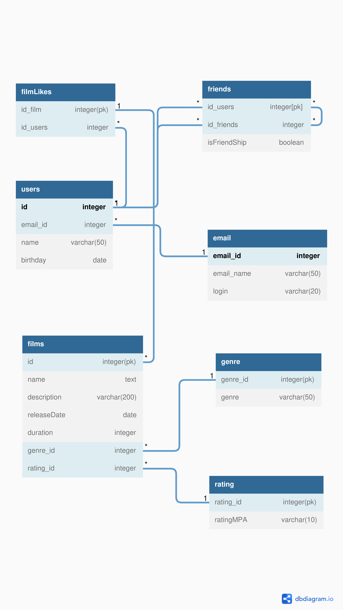

# java-filmorate
Template repository for Filmorate project.

SELECT name,  
birthday  
FROM users;

SELECT name,   
genre  
FROM films;

SELECT id_users   
FROM friends  
WHERE id_users = 1;

SELECT id_users,  
COUNT(id_friends)  
FROM friends  
GROUP BY id_users  
LIMIT 10; 
